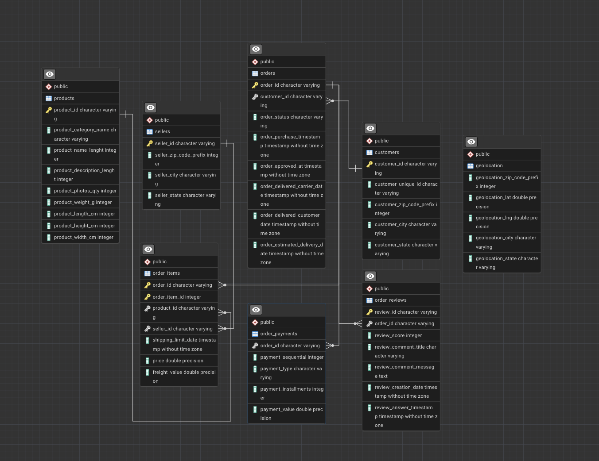

# EcomVision Analytics

## About the Company
EcomVision Analytics is a data-driven company specializing in e-commerce insights.  
Our mission is to analyze online retail data and provide valuable recommendations for business growth, customer satisfaction, and sales optimization.

## Project Description
This project focuses on analyzing the Brazilian Olist E-Commerce dataset.  
We explore customer behavior, order details, payments, reviews, sellers, and product categories to gain a deeper understanding of e-commerce dynamics.

The project includes:  
- SQL queries to extract meaningful insights from the database.  
- Static and interactive visualizations of sales, revenue, delivery, and reviews.  
- Exporting query results and aggregated data to Excel with formatting and conditional rules.  
- Demonstrating dynamic updates: adding new data in the database immediately reflects in graphs and reports.  

## Preview (Analytics Screenshot)
- All screenshots of terminal commands, query execution, and CSV results are saved in the `screenshots` folder.
- The results of SQL queries are saved in the `results` folder.
- The ER diagram
- 
- Static charts are saved in the `charts` folder.  
- Interactive charts with sliders (e.g., monthly revenue by state) are shown using Plotly.  
- All query results and aggregated tables are exported to Excel in the `exports` folder.  
- Screenshots of terminal commands, query execution, and CSV results are saved in the `screenshots` folder.  

## How to Run the Project
1. Make sure Python 3 is installed on your system.
2. Install required Python packages:
   ```bash
   pip install psycopg2-binary pandas plotly openpyxl matplotlib
3. Ensure PostgreSQL is installed and running, and the database ecommerce is created with all tables populated from CSV files.
4. Run scripts:
   charts_static.py → generates static graphs and saves them in charts/.
   analytics.py → runs interactive Plotly graphs (with slider for monthly sales) and exports all table to Excel (exports/sales_report.xlsx).
   ```bash
   python3 charts_static.py
   python3 analytics.py

5. Any new rows added to the database will automatically update the results when the scripts are rerun.

## Tools & Resources
PostgreSQL / PgAdmin
Python 3
Libraries: psycopg2, pandas, matplotlib, plotly, openpyxl
Olist E-Commerce Dataset (CSV files)
Screenshots of terminal and query results are stored in screenshots/ folder.
Static graphs are stored in charts/ folder, Excel reports in exports/ folder.

## Notes
All numeric columns in Excel reports have conditional formatting (color gradients for min/max).
Filters and frozen headers are applied in Excel for easier analysis.
<<<<<<< HEAD
Interactive Plotly graphs allow visual exploration with sliders and hover tooltips.
=======
Interactive Plotly graphs allow visual exploration with sliders and hover tooltips.
>>>>>>> 933bca9 (Добавлен экспорт дашборда Superset)
